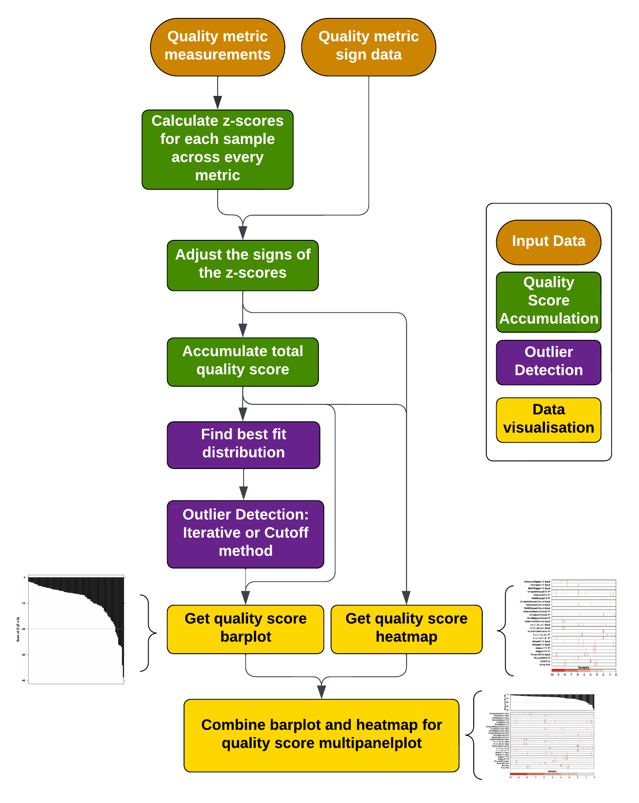

# OmicsQC

1. [Description](#description)
2. [Installation](#installation)
3. [Quick start](#quick-start)
4. [Resources](#resources)
5. [Getting help](#getting-help)
6. [Citation information](#citation-information)
7. [License](#license)

## Description

OmicsQC is a statistical framework for integrating quality control metrics from multi-sample experiments such as those investigated in large cohort-level genomic profiling studies. Metrics are aggregated into quality scores which can be used to nominate samples for exclusion.



## Installation

Using devtools in R:
```R
library(devtools);
install_github('https://github.com/uclahs-cds/package-omicsQC');
```

From source:
```shell script
git clone https://github.com/uclahs-cds/package-omicsQC.git
R CMD INSTALL package-omicsQC
```

## Quick start

```R

library(OmicsQC)

### Retrieving Data ###

# QC metrics
data('example.qc.dataframe')

# Directionality of the data
data('sign.correction')

### Calculating Z-scores ###
zscores = zscores.from.metrics(
  qc.data = example.qc.dataframe,
  filename = NULL
)

### Sign correction ###
corrected_zscores = correct.zscore.signs(
  zscores = zscores,
  signs.data = sign.correction,
  metric.col.name = "Metric",
  signs.col.name = "Sign",
  filename = NULL
)

### Summing up Z-scores ###
cum_zscores = accumulate.zscores(
  zscores.corrected = corrected_zscores,
  filename = NULL
)

### Fitting distribution ###
fit.results <- fit.and.evaluate(
  quality.scores = cum_zscores,
  trim.factor = 0.15
)

### Identifying outliers using `cosine similarity iterative` ###
outlier.detect.iterative.res <- cosine.similarity.iterative(
  quality.scores = cum_zscores,
  distribution = 'lnorm',
  no.simulations = 1000,
  trim.factor = 0.15,
  alpha.significant = 0.05
)

### Identifying outliers using `cosine similarity cutoff` ###
outlier.detect.cutoff.res <- cosine.similarity.cutoff(
  quality.scores = cum_zscores,
  distribution = 'lnorm',
  no.simulations = 1000,
  trim.factor = 0.15,
  alpha.significant = 0.05
)

### Plotting ###

# Barplot
bp = get.qc.barplot(
  quality.scores = cum_zscores
)

# Heatmap
hm = get.qc.heatmap(
  zscores = corrected_zscores,
  ylabels = ylabels
)

# Combining plots using multipanelplot
mp_plt = get.qc.multipanelplot(
  barplot = bp,
  heatmap = hm,
  # filename = "~/Desktop/mp_plot.pdf"
)

```

## Resources
* [Vignette]()

## Getting help

Looking for guidance or support with OmicsQC? Look no further.

* Check out our [Discussions](https://github.com/uclahs-cds/package-OmicsQC/discussions) page!
* Submit bugs :bug:, suggest new features :cherry_blossom: or see current work :mechanical_arm: at our [Issues](https://github.com/uclahs-cds/package-OmicsQC/issues) page.

## Citation information

<Include BioRxiv preprint>

## License

Authors: Hugo Anders Frelin, Paul C. Boutros (PBoutros@mednet.ucla.edu)

[This project] is licensed under the GNU General Public License version 2. See the file LICENSE.md for the terms of the GNU GPL license.

OmicsQC aggregates quality control metrics from multi-sample investigations and nominates samples for exclusion using an unbiased strategy.

Copyright (C) University of California Los Angeles ("Boutros Lab") All rights reserved.

This program is free software; you can redistribute it and/or modify it under the terms of the GNU General Public License as published by the Free Software Foundation; either version 2 of the License, or (at your option) any later version.

This program is distributed in the hope that it will be useful, but WITHOUT ANY WARRANTY; without even the implied warranty of MERCHANTABILITY or FITNESS FOR A PARTICULAR PURPOSE. See the GNU General Public License for more details.
