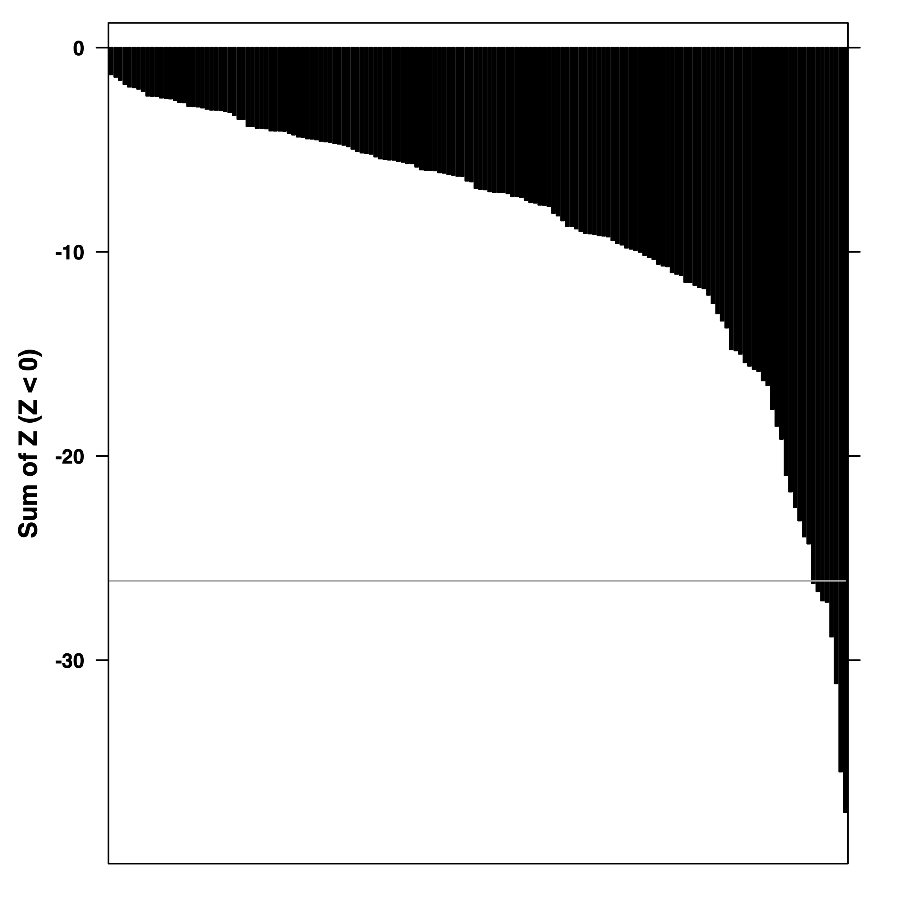
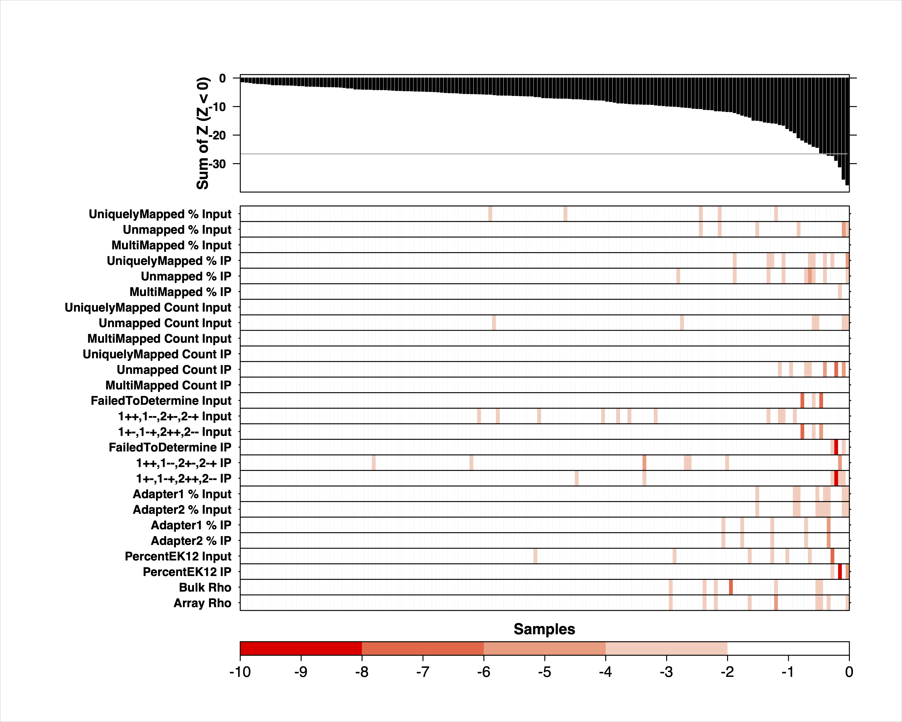

```{r, include = FALSE}
knitr::opts_chunk$set(
  collapse = TRUE,
  comment = "#>"
)
```

Loading package as well as example data.

```{r setup, warning = FALSE, message = FALSE}
library(OmicsQC);
data('example.qc.dataframe');
data('sign.correction');
data('ylabels');
```

```{r, echo=FALSE, message=FALSE, warning = FALSE}
library(kableExtra);
library(dplyr);
```

# Introduction
omicsQC is a package designed to nominate outlier samples in genomic experimental cohorts. The package can be subdivided into three parts, quality score calculation, outlier detection, and data visualization. The flowchart below displays how these parts interact, and the flow of data throughout the package. The package comes with example data, consisting of 100 samples that all have been scored according to 26 quality metrics.

```{r, echo=FALSE, out.width="80%", fig.cap="Flowchart of omicsQC"}
knitr::include_graphics("omicsQCFlowchart.png")
```

# Generation and aggregation of z-scores

### Calculating z-scores: ```zscores.from.metrics()```
In order to get a total score for the quality of a sample, this package will calculate the z-score of each test metric for each sample and then accumulate the z-scores for a total quality score. This package can be used independent of test metrics used.

```zscores.from.metrics()``` takes the dataframe containing the sample metrics and calculates the z-score for each metric and sample. Each row of qc.data should correspond to a sample, and each column to a test metric. An example input dataframe can be seen below.

```{r, echo=FALSE}
head(example.qc.dataframe) %>% kbl() %>% kable_styling()
```

```{r}
zscores <- zscores.from.metrics(example.qc.dataframe, filename = NULL);
```

The function returns zscores, which is a dataframe containing the z-scores for each sample and test metric. The example data in this package would return the dataframe below.

```{r, echo=FALSE}
head(zscores) %>% kbl() %>% kable_styling()
```


### Adjusting the z-score signs: ```correct.zscore.signs()```
This package is designed to be independent of test metrics used, but since some test metrics are better if they are larger and some are better if they are smaller, the sign of a poor z-score will differ between the metrics. We must therefore adjust the metrics such that negative z-scores is considered a bad measurement across all tests. This is done by providing a dataframe that states if a positive or a negative z-score is good for each metric. It should be of the same format as the table displayed below and have a value, 'neg' or 'pos' for each metric used.

The function also sets all non-negative z-scores to zero to make sure positive and negative values do not cancel each other out when we calculate an accumulated score.

Apart from the zscores, and sign.correct, the function also takes the names of the columns containing the metric name and the sign instructions in sign.correct.

```{r, echo=FALSE}
head(sign.correction) %>% kbl() %>% kable_styling()
```

```{r}
zscores.corrected <- correct.zscore.signs(zscores, sign.correction, 'Metric', 'Sign')
```

zscores.corrected can now be used to calculate accumulated scores for each sample.
```{r, echo=FALSE}
head(zscores.corrected) %>% kbl() %>% kable_styling()
```


### Calculating total quality score: ``` accumulate.zscores()```
accumulate.zscores takes the zscores.corrected dataframe and calculates a total quality score for each sample. It does this by summing over all negative z-scores. It then orders the data by quality score size and returns it.

```{r}
quality.scores <- accumulate.zscores(zscores.corrected);
```

quality.scores look like:

```{r, echo=FALSE}
head(quality.scores) %>% kbl() %>% kable_styling()
```

## Cosine outlier detection
The second part of the package offers distribution fitting and outlier detection using two implementations of the cosine outlier detection method. They are both based on cosine similarity, but the two implementations offer pros and cons. Generally speaking, the cutoff method has a low sensitivity but a high precision, while the iterative method has a high sensitivity but low precision.  

### Finding best fit distribution: ```fit.and.evaluate()```
This function takes the quality.scores and evaluates how well they fit to some common distributions. It returns a [Bayesian Information Criterion](https://www.sciencedirect.com/topics/social-sciences/bayesian-information-criterion) score as well as a [Kolmogorov–Smirnov](https://www.sciencedirect.com/topics/medicine-and-dentistry/kolmogorov-smirnov-test) test result for each distribution.

```{r}
fit.results <- fit.and.evaluate(
    quality.scores = quality.scores,
    trim.factor = 0.15
    );
```

```fit.and.evaluate()``` returns the dataframe printed below.

```{r, echo=FALSE}
fit.results %>% kbl() %>% kable_styling()
```

### Iterative Method: ```cosine.similarity.iterative()``
This function takes quality.scores, trims it and fits it to the distribution given. It then  tests the largest datapoint compared a null distribution of size no.simulations. If the largest datapoint has a significant p-value it tests the 2nd largest one and so on, until it reaches a datapoint whose p-value is insignificany.

```{r}
outlier.detect.iterative.res <- cosine.similarity.iterative(
    quality.scores = quality.scores,
    distribution = 'lnorm',
    no.simulations = 1000,
    trim.factor = 0.15,
    alpha.significant = 0.05
    );
```

Number of outliers found:
```{r}
outlier.detect.iterative.res$no.outliers
```

The sample labels of the outliers:
```{r}
outlier.detect.iterative.res$outlier.labels
```

### Cutoff Method: ```cosine.similarity.iterative()``
This function takes quality.scores, trims it and fits it to the distribution given. It then simulates as many datasets as stated by no.simulations, and computes the cosine similarity of each dataset against theoretical distribution. It uses what would correspond to a significant value to then calculate what observed value this would correspond to.

```{r}
outlier.detect.cutoff.res <- cosine.similarity.cutoff(
    quality.scores = quality.scores,
    distribution = 'lnorm',
    no.simulations = 1000,
    trim.factor = 0.15,
    alpha.significant = 0.05
    );
```

Quality score cutoff:
```{r}
outlier.detect.cutoff.res$cutoff
```

Number of outliers found:
```{r}
outlier.detect.cutoff.res$no.outliers
```

The sample labels of the outliers:
```{r}
outlier.detect.cutoff.res$outlier.labels
```

## Data visualisation
The third aspect of the package is the standard visualisation of the QC data. This is implemented using the package [BoutrosLab.plotting.general](https://cran.r-project.org/web/packages/BoutrosLab.plotting.general/BoutrosLab.plotting.general.pdf). These functions offer standardised, hard-coded plots to simplify the data visualisation, however one can also implement the plots themselves for more customisability.

### Quality Score Barplot: ```get.qc.barplot()```
This function takes the accumulated quality scores and returns a barplot ranging from lowest to highest. It also plots a cut-off for what the accepted lowest score is. If filename is not NULL, it is saved to file, else the trellis object is returned.

```{r}
qc.barplot <- get.qc.barplot(quality.scores)
```

```{r}
qc.barplot <- get.qc.barplot(
    quality.scores = quality.scores,
    abline.h = - outlier.detect.cutoff.res$cutoff
    );
```

```{r, echo=FALSE, out.width="80%", fig.cap="Barplot generated by get.qc.barplot()"}

```

### Z-Score Heatmap: ```get.qc.heatmap()```
This function takes the dataframe with the z-scores for each sample and metric as well as vector of labels for the y-axis. The labels should be the full names of the metrics in the same order as they are in the dataframe. The function also takes quality.scores to make sure the samples are in the correct order on the heatmap.The function returns a standardised heatmap. If filename is not NULL, it is saved to file, else the trellis object is returned.

``` {r}
qc.heatmap <- get.qc.heatmap(zscores.corrected, quality.scores, ylabels)
```

```{r, echo=FALSE, out.width="80%", fig.cap="Heatmap generated by get.qc.heatmap()"}
knitr::include_graphics("heatmap.png")
```

### Aggregating the plots: ```get.qc.multipanelplot()```
Now that both the heat map and barplot has been generated they can be aggregated to a multipanelplot. get.qc.multipanelplot() takes the barplot, heatmap and a filename and concatenates the plots in a standardised format and saves the multipanelplot to file.

``` {r, eval=FALSE}
qc.multipanel <- get.qc.multipanelplot(qc.barplot, qc.heatmap)
```

```{r, echo=FALSE, out.width="80%", fig.cap="The final multipanelplot generated"}

```
