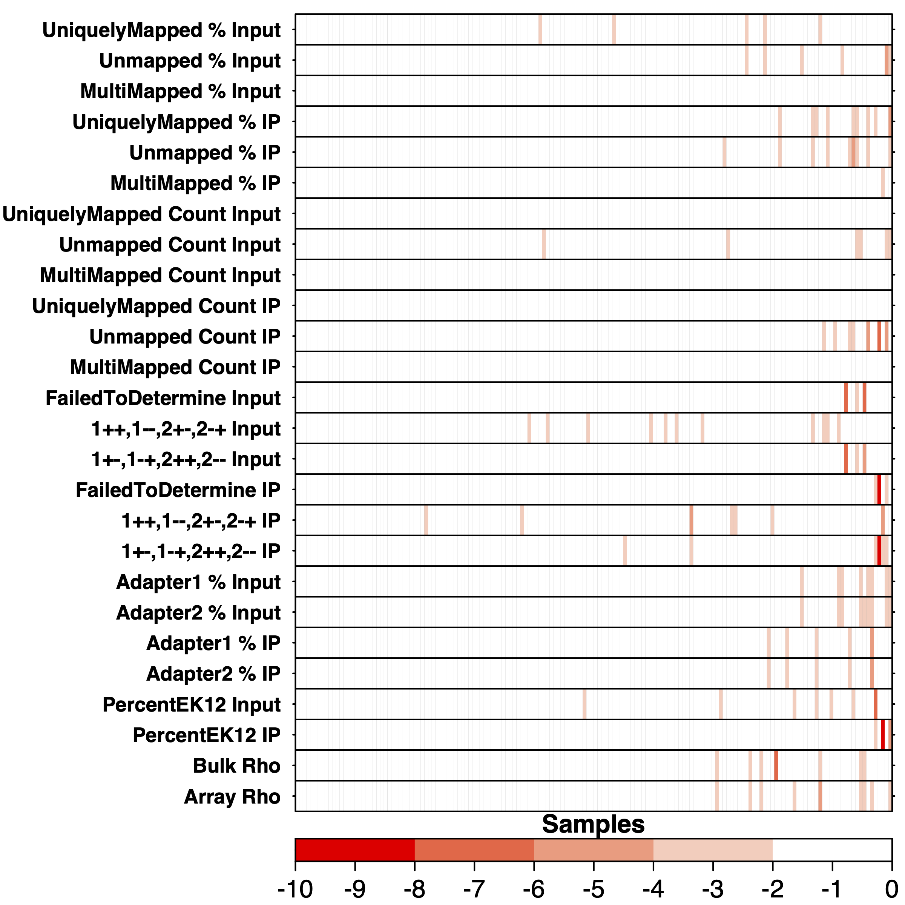

```{r, include = FALSE}
knitr::opts_chunk$set(
  collapse = TRUE,
  comment = '#>'
  );
```

```{r load_dependencies, echo=FALSE, message=FALSE, warning = FALSE}
library(kableExtra);
library(dplyr);
```

# Introduction
OmicsQC is a package designed to analyze quality control metrics for multi-sample studies and nominate putative outlier samples for exclusion using unbiased statistical approaches. The package can be subdivided into three parts: quality score calculation, outlier detection, and data visualization. The flowchart below illustrates how these parts interact and the flow of data throughout the package. The package comes with example data, consisting of 100 samples from a recent profiling study that all have been scored according to 26 quality control metrics.

```{r, echo=FALSE, out.width='80%'}
knitr::include_graphics('omicsQCFlowchart.png')
```

# Setup
Loading package and importing example data:

```{r setup, warning = FALSE, message = FALSE}
library(OmicsQC);

# Loading Data
data('example.qc.dataframe'); # Metric scores across samples
data('sign.correction'); # The directionality of metrics
data('ylabels'); # Formatted metric labels for heatmap
```

# Generation and aggregation of z-scores

To get a total score for the quality of a sample, this package will calculate the z-score of each test metric for each sample, correct for the directionality of each metric, and aggregate the z-scores by the sum across metrics. This package can be used independent of test metrics used.

### Calculation of z-scores

`zscores.from.metrics` takes quality control data for each sample and calculates the z-score across each metric. Each row of `qc.data` should correspond to a sample, and each column to a test metric. An example input dataframe can be seen below.

```{r print_example_data, echo=FALSE}
head(example.qc.dataframe) %>%
  kbl() %>%
  kable_styling()
```

```{r calculate_zscores}
zscores <- zscores.from.metrics(qc.data = example.qc.dataframe);
```

The function returns a dataframe containing the z-scores for each sample and test metric. The example data in this package would return the dataframe below.

```{r print_calculated_zscores, echo=FALSE}
head(zscores) %>%
  kbl() %>%
  kable_styling()
```

### Adjusting metric directionality
This package is designed to be independent of test metrics used, but since some test metrics are better if they are larger and some are better if they are smaller, the sign of a poor z-score will differ between the metrics. We must therefore adjust the metrics such that negative z-scores is considered a bad measurement across all tests. The function `correct.zscore.signs` requires input that states if a positive or a negative z-score is good for each metric. This input takes the form of a dataframe with a column for metric and a column for sign which have the potential values 'pos' or 'neg' for each metric used.

The function `correct.zscore.signs` also sets all non-negative z-scores to zero to make sure positive and negative values do not cancel each other out when we calculate an accumulated score.

Apart from the `zscores`, and `signs.data`, the function also takes the names of the columns containing the metric name and the sign instructions in `sign.data`.

```{r print_sign_correction_dataframe, echo=FALSE}
head(sign.correction) %>%
  kbl() %>%
  kable_styling()
```

```{r correct_zscores}
zscores.corrected <- correct.zscore.signs(
  zscores = zscores,
  signs.data = sign.correction,
  metric.col.name = 'Metric',
  signs.col.name = 'Sign'
  );
```

The output of the function, `zscores.corrected`, can now be used to calculate accumulated scores for each sample.

```{r print_corrected_zscores, echo=FALSE}
head(zscores.corrected) %>%
  kbl() %>%
  kable_styling()
```

### Calculating total quality score
`accumulate.zscores` takes the `zscores.corrected` dataframe and calculates a total quality score for each sample. It does this by summing over all negative z-scores. It then orders the data by the magnitude of the quality score and returns the result in a dataframe.

```{r accumulate_zscores}
quality.scores <- accumulate.zscores(zscores.corrected = zscores.corrected);
```

The resulting `quality.scores` is shown below:

```{r print_accumulated_zscores, echo=FALSE}
head(quality.scores) %>%
  kbl() %>%
  kable_styling()
```

# Outlier detection using cosine similarity
The second part of the package offers distribution fitting and outlier detection using two implementations of the cosine outlier detection method. They are both based on cosine similarity, but the two implementations offer pros and cons. Generally speaking, the cutoff method has a low sensitivity but a high precision, while the iterative method has a high sensitivity but low precision.  

### Finding the best fitting distribution
The function `fit.and.evaluate` takes the quality.scores and evaluates how well they fit to some common distributions. It returns a [Bayesian Information Criterion](https://www.sciencedirect.com/topics/social-sciences/bayesian-information-criterion) score as well as a [Kolmogorov–Smirnov](https://www.sciencedirect.com/topics/medicine-and-dentistry/kolmogorov-smirnov-test) test result for each distribution.

```{r fit_distributions}
fit.results <- fit.and.evaluate(
    quality.scores = quality.scores,
    trim.factor = 0.15
    );
```

`fit.and.evaluate` returns the dataframe printed below:

```{r print_fit_distribution_results, echo=FALSE}
fit.results %>%
  kbl() %>%
  kable_styling()
```

### The iterative method for outlier nomination using cosine similarity
The function `cosine.similarity.iterative` takes `quality.scores`, trims the proportion of data indicated by `trim.factor` from each extreme, and fits it to the distribution given. It then tests the largest datapoint compared a null distribution of size `no.simulations`. If the largest datapoint has a significant p-value, it moves onto the 2nd largest datapoint and so on, until it reaches a datapoint whose p-value is insignificant.

```{r cosine_similarity_iterative}
outlier.detect.iterative.res <- cosine.similarity.iterative(
    quality.scores = quality.scores,
    distribution = 'lnorm',
    no.simulations = 1000,
    trim.factor = 0.15,
    alpha.significant = 0.05
    );
```

Number of outliers found:
```{r print_iterative_number_outliers}
print(outlier.detect.iterative.res$no.outliers);
```

The sample labels of the outliers:
```{r print_iterative_outliers}
print(outlier.detect.iterative.res$outlier.labels);
```

### The cutoff method for outlier nomination using cosine similarity
The function `cosine.similarity.cutoff` takes `quality.scores`, trims the proportion of data indicated by `trim.factor` from each extreme, and fits it to the distribution given. It then simulates as many datasets as stated by `no.simulations`, and computes the cosine similarity of each dataset against theoretical distribution. Using this simulatd dataset, it estimates the cutoff threshold for cosine similarity which would correspond to a statistically significant p-value (determined by `alpha.significant`) and nominates outliers that surpass this threshold.

```{r cosine_similarity_cutoff}
outlier.detect.cutoff.res <- cosine.similarity.cutoff(
    quality.scores = quality.scores,
    distribution = 'lnorm',
    no.simulations = 1000,
    trim.factor = 0.15,
    alpha.significant = 0.05
    );
```

Quality score cutoff:
```{r cutoff}
print(outlier.detect.cutoff.res$cutoff);
```

Number of outliers found:
```{r cutoff_number_outliers}
print(outlier.detect.cutoff.res$no.outliers);
```

The sample labels of the outliers:
```{r cutoff_outliers}
print(outlier.detect.cutoff.res$outlier.labels);
```

# Data visualisation
The third aspect of the package is the visualization of the quality control data. Several functions have been adapted from the package [BoutrosLab.plotting.general](https://cran.r-project.org/web/packages/BoutrosLab.plotting.general/BoutrosLab.plotting.general.pdf) and customized for the purposes of this package. These functions offer standardized plots with flexibility for customization to aid in data visualization.

### Quality score barplot
The function `get.qc.barplot` takes the accumulated quality scores (`quality.scores`) and returns a barplot displaying the scores from lowest to highest. It can also optionally depict a cut-off for outlier nomination. If filename is not NULL, it is saved to file. Otherwise, the trellis object is returned.

```{r barplot_with_cutoff}
qc.barplot <- get.qc.barplot(
    quality.scores = quality.scores,
    abline.h = - outlier.detect.cutoff.res$cutoff
    );
```

```{r print_barplot, echo=FALSE, out.width='80%'}
;
```

### Z-score heatmap
The function `get.qc.heatmap` takes the dataframe with the corrected z-scores for each sample (`zscores.corrected`) and metric as well as a vector of labels (`ylabels`) for the y-axis. The labels should be the full names of the metrics in the same order as they are in the dataframe. The function also takes `quality.scores` to make sure the samples are in the correct order on the heatmap. The function returns a standardized heatmap. If filename is not NULL, it is saved to file. Otherwise, the trellis object is returned.

``` {r heatmap}
qc.heatmap <- get.qc.heatmap(
  zscores = zscores.corrected,
  quality.scores = quality.scores,
  yaxis.lab = ylabels
  );
```

```{r print_heatmap, echo=FALSE, out.width='80%'}
;
```

### Aggregating the plots
Now that both the heat map and barplot has been generated they can be aggregated to a multipanelplot. `get.qc.multipanelplot` takes the barplot, heatmap and a filename and concatenates the plots in a standardized format and saves the multipanelplot to file.

``` {r multipanelplot, eval=FALSE}
qc.multipanel <- get.qc.multipanelplot(
  barplot = qc.barplot,
  heatmap = qc.heatmap
  );
```

```{r print_multipanelplot, echo=FALSE, out.width='80%'}
;
```
